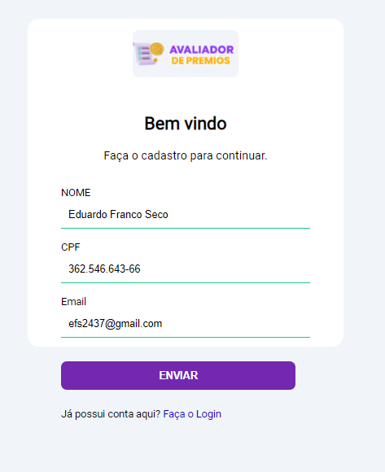
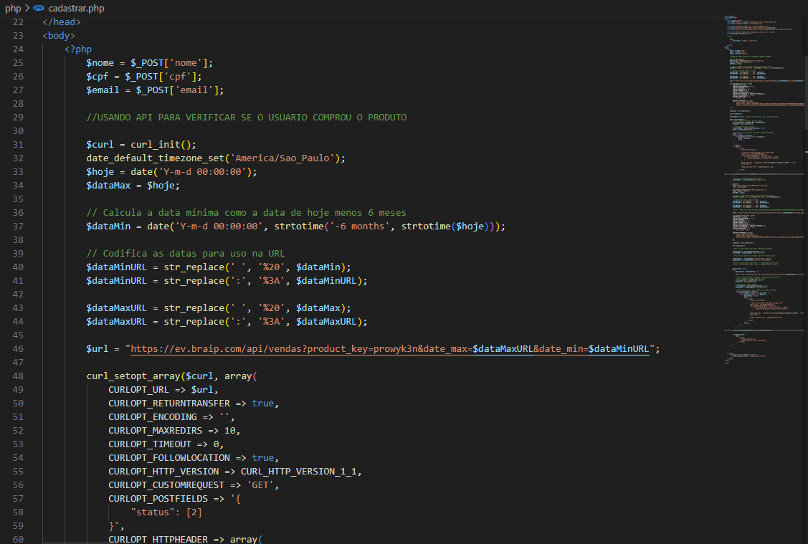
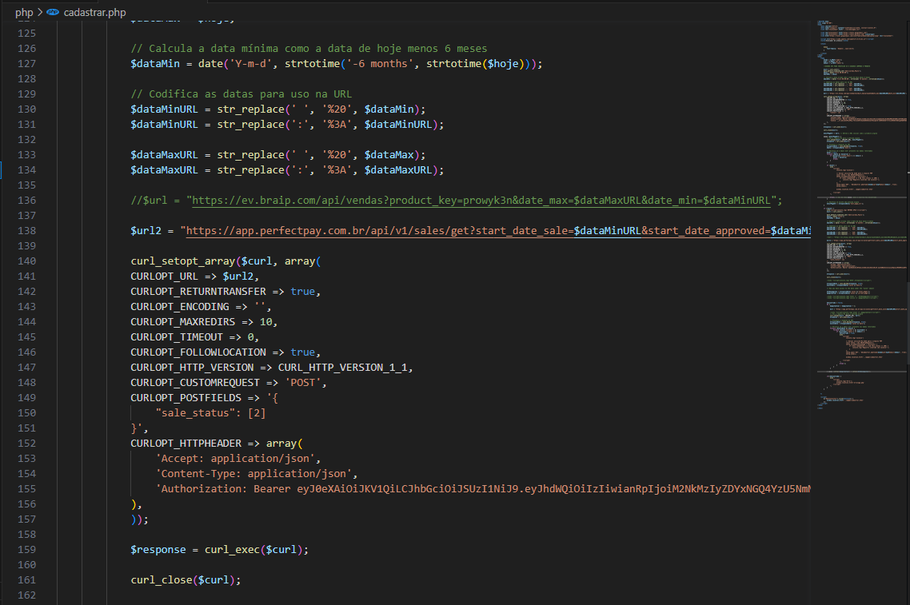
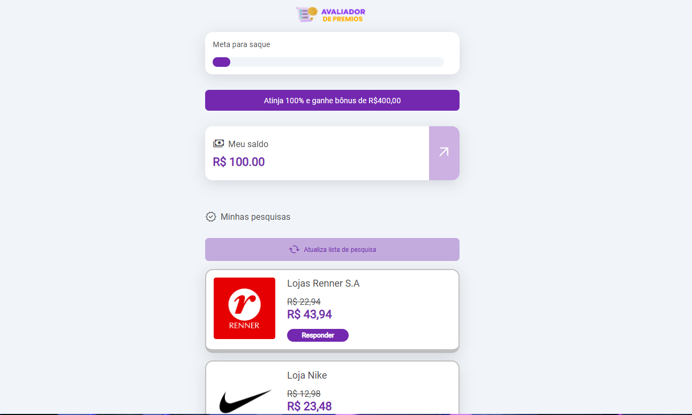
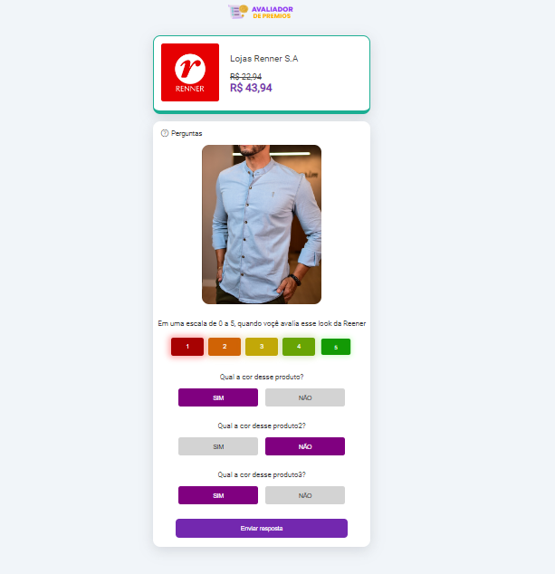
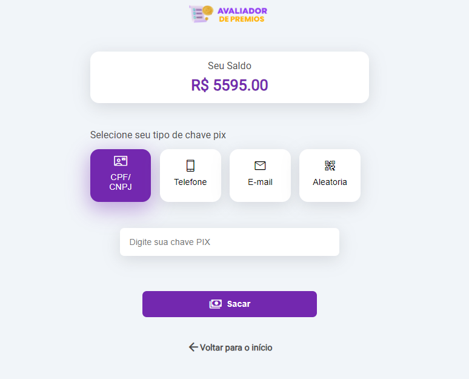

# Avaliador-de-Premios

Olá, Meu nome é Eduardo Este repositório mostra um trabalho Freelancer realizado por min, no qual fui o desenvolvedor Full Stack de um website. 

 O Avaliador de Premios é um site onde o usuário pode ganhar dinheiro apenas avaliando produtos de marcas famosas. O site não é aberto! Ou seja, você precisa comprar para ter acesso, é vendido por duas grandes plataformas a Perfectpay e a Braip. Nesta aplicação sou o desenvolvedor que foi contratado para criá-lo, não tenho a ver com vendas ou problemas relacionadas ao site! Todo design foi dado pelo contratante para que eu seguisse.
 
 Essa Freelancer ajudou a minha evolução na criação de websites, mesmo tendo ficado preso a um design simples para o nível de front end atual meu, O beck end foi um grande desafio para min pois o site começa com uma interface de cadastro:
 

   
   

  Nesta parte o usuário entra com seus dados e há uma verificação em JavaScript para que o preenchimento do formulário esteja correto, com os dados enviados tenho que consegui verificar se o usuário comprou o produto nas plataformas Perfectpay e a Braip, para isso tenho que utilizar duas APIs simultaneamente aonde primeira menta utilizo a API da Braip com filtros para trazes todos os usuários que compraram o produto, com isso pego o dados que o usuário forneceu no formulário e pesquiso para ver se tal comprou o produto, todo essa manipulação da api é feita com a linguem de programação PHP, aonde a api limita apenas 100 usuários por páginas, e a api trás diversas páginas na qual tenho que varre todas as paginas uma por uma para verificar se o usuário compro, claro isso tudo feio com o PHP nada manual.

   
   

  Na imagem mostra um breve trecho do código de consumo da primeira api, agora verifico se o usuário foi encontrado na api da Braip caso o usuário tenha sido encontrado ele é castrado no banco do site e tem acessos, caso o usuário não tenha sido encontrado eu consumo a API da   Perfectpay na qual também tenho que varrer todas as paginas da API atras do usuário e refaço a verificação se agora o usuário tenha sido encontrado ele é cadastrado, e caso não o usuário ira para um tela de erro e com botão para acessar o link e comprar o produto ou entrar em contato, abaixo esta outro breve trecho do código consumindo a segunda API.

   
   

  Esta parte me deu um conhecimento ainda maior sobrea manipulação de APIs tanto em PHP ou em JavaScript, agora com o usuário entrando no site cairá na home:

   
   

  Nessa parte o usuário pode ver o seu saldo a barra de meta de saque e baixo as marcas para ele avaliar os produtos, cada marca tem diversos produtos cadastrados, quando o usuário entra em uns deles ira para esta página:

   
   

Nesta tela é toda construída em PHP com Javascript, pois tenho que trazer todos esses elementos do banco de dados e mostrá-lo na tela, para isso pega as informações aleatoriamente do banco de dados para o usuário pode avaliar, e claro tendo uma verificação para nunca cair o mesmo produto duas vezes, após avaliar o produto o usuário ganhara a quantia mostrada na marca. Com isto basta o usuário ficar avaliando looks até atingir a meta e poder sacar seu dinheiro.

   
   

 Nesta tela o usuário pode colocar os dados do pix e ele recebera o valor atual que está na sua conta. Para isso funcionar utilizo o PHP para enviar os dados por e-mail para a esquipe enviar o pagamento para o usuário. 

  Está é a aplicação o a qual levou o tempo de 9 dias para realizá-la trabalhando várias horas por dia. Esse freelancer foi um bom começo de carreira daiquiri muito conhecimento tanto técnico na criação do código, quando na noção de como o usuário usaria o site, e tanto na de analista e entender o que o contratante queria e realizar a criação do website perfeitamente. 

 
 

Aqui são umas das linguagens de progamação que tenho conhecimento. e que utilizo para criar meus sites 💻
 

  
  
  
  
  
  
  
  
  
  
            
  ##
 

 
  
  
  
  
  
  

  
  
 

